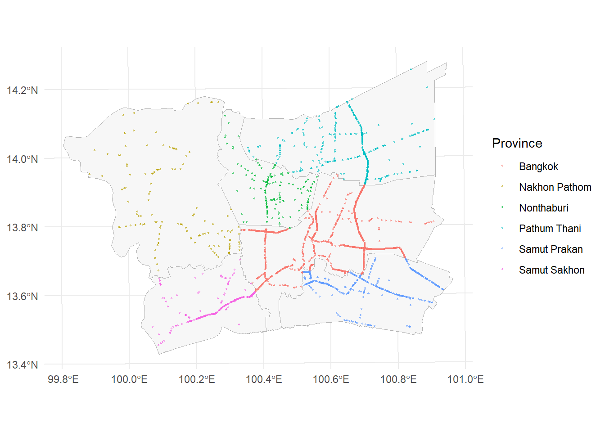
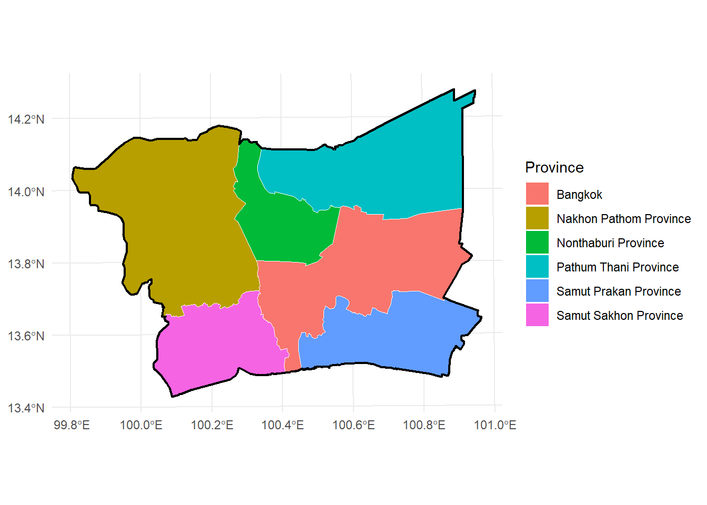
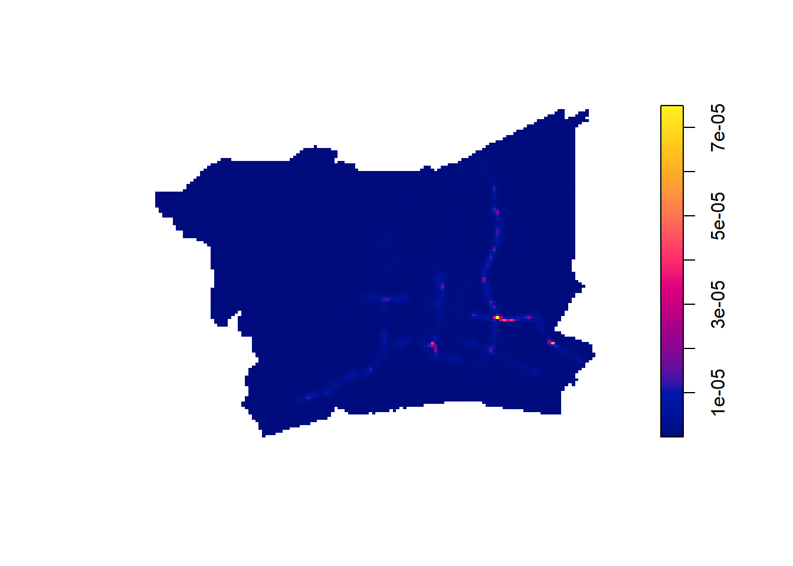
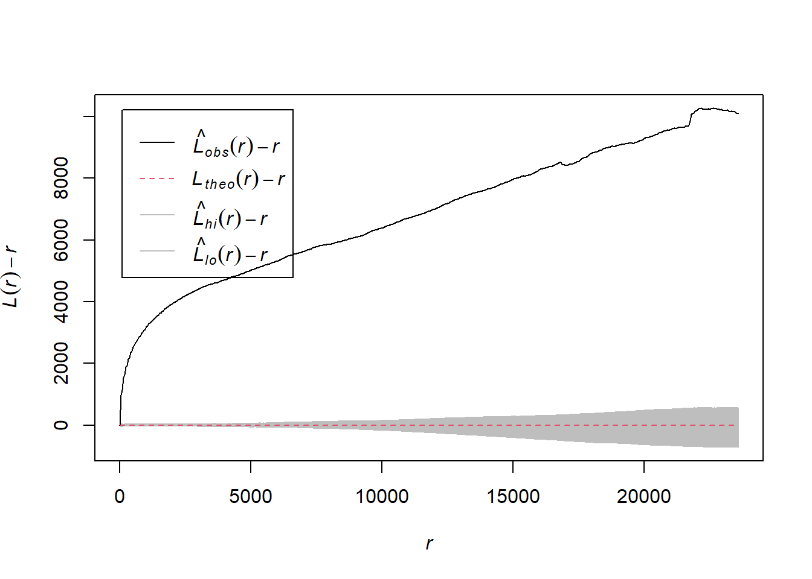
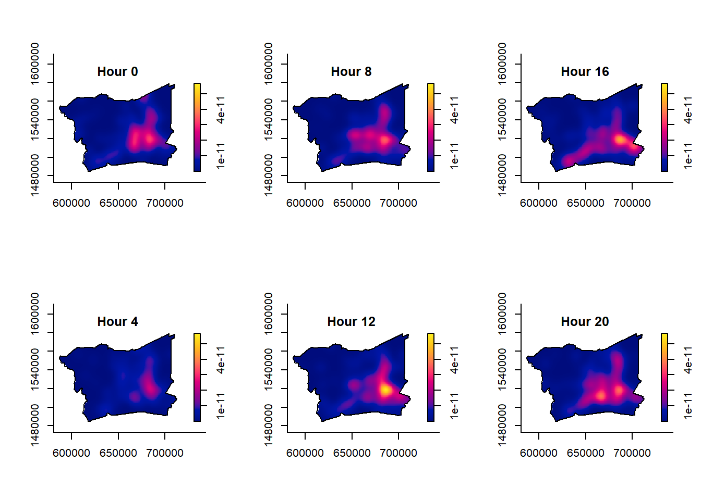
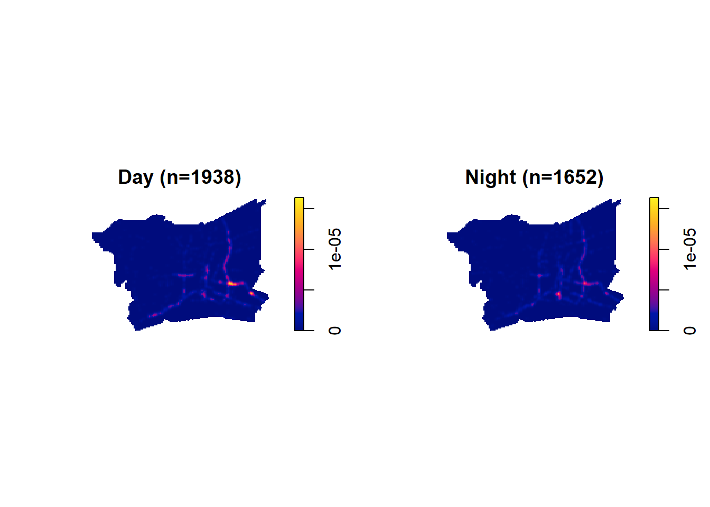
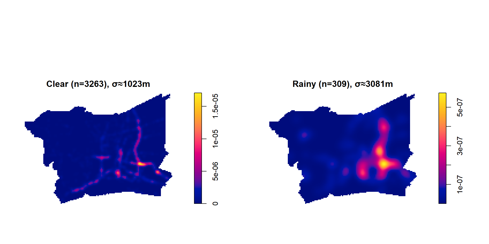

## Where this analysis looks

- Where are 2022 accidents concentrated?
- Is that clustering real, or just coincidence?
- Does the cluster's location change with time, month, or weather?

{fig-align="center"}

## Study Area & Data

- Bangkok + 5 surrounding provinces (BMR), 2022
- 3,590 geolocated accidents after cleaning
- Data: Kaggle accident records + geoBoundaries province polygons
- Projected to EPSG:32647 (UTM 47N, metres)

{fig-align="center"}

## Methodology

- KDE — where is intensity highest
- G / F / K / L + Clark-Evans — is the clustering statistically real
- STKDE — does the hotspot move over time
- segregation.test() — is a day/night or weather split really different

## First-Order Analysis: Where

- Adaptive KDE, bandwidth chosen with bw.ppl() (≈750m)
- Hotspot sits at a major interchange in central-eastern Bangkok
- Intensity follows the road network, not spread evenly

{fig-align="center"}

## Second-Order Analysis: Is It Real?

- G, F, K, L functions all reject CSR (complete spatial randomness)
- Clark-Evans R = 0.215, p < 2.2×10⁻¹⁶
- Clustering holds from the shortest to the longest distances tested

{fig-align="center"}

## Spatio-Temporal Analysis: The Hotspot Moves

- By hour: single peak at night, spreads out during the morning commute, sharpens again at midday
- By month: same location all year, but intensity jumps October–December

{fig-align="center"}

## Day vs. Night, Weekday vs. Weekend

- Day vs. night: significantly different locations (p = 0.01)
- Weekday vs. weekend: same locations, only volume differs (p = 0.34; 2,549 vs. 1,041)

{fig-align="center"}

## Value-Added: Does Weather Matter?

- 3,263 clear-weather points vs. 309 rainy-weather points
- Locations differ significantly (p = 0.01)
- Rainy-weather accidents concentrate in the east-central area, not just a smaller version of the usual hotspot

{fig-align="center"}

## Public Safety Implications

- Concentrate enforcement at the central-eastern interchange — the hotspot every analysis points to
- Shift patrol locations between day and night, not just add more patrols
- Check drainage and signage at the east-central cluster before rainy season
- Plan for higher, more concentrated demand October–December

## Limitations & Conclusion

- BMR boundary is a province-name union, not an official metro polygon
- 5% of records had no coordinates and were dropped
- 321 duplicate coordinates jittered to fix a statistical issue
- Day/night split is a fixed clock boundary, not actual daylight

**Conclusion:** 2022 BMR accidents cluster along the road network, the clustering is statistically real, and where it clusters shifts by time of day, month, and weather — not just how many accidents happen.
